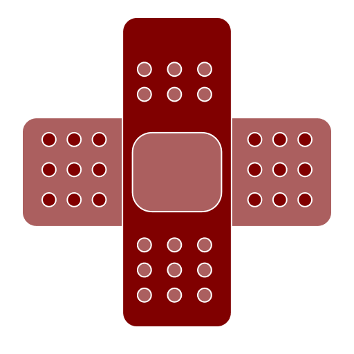

<div align="center">
  
  <h1>Rakshya 🛡️</h1>
  <p><strong>Your Ultimate Personal Safety & Health Companion</strong></p>
</div>

<div align="center">
  
  
  
</div>

<br/>

Rakshya (or *Raksha*) is an award-winning health and safety mobile application built with React Native. Designed to be a literal lifesaver, it provides immediate first aid assistance, voice-activated emergency features, shake detection, and a built-in panic system to keep you and your loved ones safe during critical moments.

---

## 🌟 Key Features

* **🚑 Immediate First Aid Guides**: Easy-to-follow, step-by-step visual and textual guides for critical emergencies including:
  * CPR (Cardiopulmonary Resuscitation)
  * Severe Bleeding
  * Choking hazards
  * Administering Stitches
* **🚨 Emergency Panic Button**: A prominent, quick-access button to trigger immediate alerts and actions in dangerous situations.
* **📳 Shake Detection Module**: Hardware-level sensor integration that detects sudden, violent shaking to instantly activate emergency responses without needing to unlock the phone.
* **🗣️ Intelligent Voice Commands**: Hands-free navigation and emergency dispatch utilizing native voice recognition.
* **🏥 Nearby Hospital Locator**: Geolocation-based integration that finds and lists the closest hospitals and medical facilities in your vicinity.
* **🩺 Doctor Consultations**: Dedicated screens and logic to connect with medical professionals securely.

## 🗣️ Supported Voice Commands

Rakshya comes with robust voice recognition to assist you hands-free:

| Command | Action |
| --- | --- |
| *"help [your_emergency]"* | Opens relevant first aid information |
| *"turn on dark mode" / "light mode"* | Toggles application theme |
| *"how to give a cpr"* | Navigates directly to the CPR guide |
| *"how to apply stitches"* | Navigates directly to the Stitches guide |
| *"how to stop choking"* | Navigates directly to the Choking guide |
| *"how to stop bleeding"* | Navigates directly to the Bleeding guide |
| *"hospitals near me"* / *"medicals near me"* | Shows nearby hospitals or medical stores |
| *"call the police"* / *"ambulance"* / *"fire brigade"*| Instantly calls the respective emergency service |
| *"where am i"* | Retrieves your current geolocation coordinates |
| *"go back"* | Navigates to the home page |

## 🛠️ Technology Stack

* **Core Framework**: [React Native](https://reactnative.dev/) (v0.72)
* **Language**: TypeScript
* **Styling**: [TailwindCSS](https://tailwindcss.com/) via [NativeWind](https://www.nativewind.dev/)
* **Routing**: [React Navigation](https://reactnavigation.org/)
* **Native Modules & Capabilities**:
  * `react-native-geolocation-service` (Real-time location)
  * `react-native-async-storage` (Local data persistence)
  * `react-native-permissions` (System permissions management)
  * Custom `ShakeDetectionModule` for hardware acceleration monitoring

## 🚀 Installation & Setup

1. **Clone the repository**
   ```bash
   git clone https://github.com/rohit661199/Rakshya-.git
   cd Rakshya
   ```

2. **Install dependencies**
   ```bash
   npm install
   # or
   yarn install
   ```
   *(Ensure you have Node.js v16+ installed.)*

3. **Link Native Assets**
   *(If required by any native dependencies like vector icons)*
   ```bash
   npx react-native link
   ```

4. **Run the Application**

   * **For Android:**
     ```bash
     npm run android
     ```
   * **For iOS:**
     ```bash
     cd ios && pod install && cd ..
     npm run ios
     ```

## 📁 Project Structure

* `/src/screens/` - Contains all main application views (Onboarding, Home, First Aid, Doctor).
* `/src/components/` - Reusable UI widgets (e.g., `Panic.tsx`, `HospitalList.tsx`).
* `/assets/` - Static assets, images, and procedure diagrams.
* `/medic/` & `data.js` - Mocked datasets for hospitals and medical information.
* `/BackgroundTask.js` & `/ShakeDetectionModule.js` - Core services for background listening and hardware event tracking.

---
<div align="center">
  <i>Stay Safe, Stay Prepared.</i>
</div>
